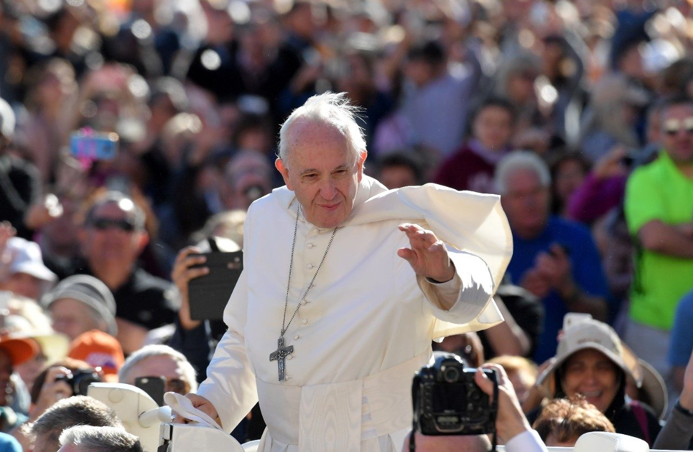

# 《教宗方济各致中国天主教信友及普世教会文告》全文

## 摘要

- 作者: 梵蒂冈新闻网
- 来源: [https://www.vaticannews.va/zh/pope/news/2018-09/zh-pope-francis-message-chinese-catholic.html](https://www.vaticannews.va/zh/pope/news/2018-09/zh-pope-francis-message-chinese-catholic.html)

> 在圣座与中华人民共和国针对主教任命问题签署一份临时性协议后，教宗方济各9月26日向中国天主教信友和普世教会发表了一封信函。教宗首先向所有忍受磨难的中国信友们致以钦佩之情，为中国教会的圆满合一发出呼吁，并尤其鼓励中国青年以活泼的信德，为建设祖国未来而合作，用热情将福音的喜乐带给所有的人。教宗就协议的价值与目标提出灵性指示，吁请普世教会的信友们以祈祷和友爱陪伴在中国的弟兄姊妹们。此外，教宗也勉励在中国的地方教会团体负责人与民政当局互相对话及聆听，「克服彼此敌对的态度」；圣座也邀请中国领导人一同继续走对话之路，以增进圣座与「中国人民真正的友谊」。

## 内容

<b>教宗方济各致中国天主教信友及普世教会文告</b>
 

<b>“<i>他的慈爱直到永恒，他的忠信世世长存</i>”</b>
 

<b><i>(圣咏100,5)</i></b>
 

在中国教会内最亲爱的主教弟兄、司铎、度奉献生活者及全体教友，让我们感谢上主，因为祂的慈爱直到永恒,并承认“祂造成了我们，我们非祂莫属，是祂的子民，是祂牧场的羊群！” (圣咏100,3)。<b><i></i></b>
 

此刻，在我的心灵深处回响起我可敬的前任教宗在2007年5月27日的信中劝勉你们的话：“在中国的天主教会啊，妳这个在那跋涉于历史中的亿万人民中生活和工作的小小羊群，耶稣的话对你是何等鼓舞和具挑战性：‘你们小小的羊群，不要害怕！因为你们的父喜欢把天国赐给你们’（路12，32）。[…]因此，‘你们的光也当在人前照耀，好使他们看见你们的善行，光荣你们在天之父’（玛5，16）” （教宗本笃十六世《<i>致中华人民共和国内天主教主教、司铎、度奉献生活者、教友</i>》，2007年5月27日，第五节。）。
 

1.&nbsp;&nbsp;&nbsp;&nbsp;&nbsp;&nbsp;&nbsp; 近期，针对目前在中国的天主教团体，尤其是针对它的未来，流传著许多彼此相反的声音。我知道这些纷乱的意见和看法会导致不少的混乱，会在许多人内心引发反面的情绪。对某些人而言，会产生疑问和困惑；而对另一些人而言，则有如同被圣座抛弃的感觉，与此同时，会对因为忠于伯多禄继承人而承受苦难的价值提出令人苦恼的问题；相反,对许多人而言，积极的等待和反思激发了对更加宁静未来的希望，以便在中国土地上做出富有成效的信仰见证。
 

这种局势的到来， 特别突显有关圣座与中华人民共和国之间的临时性协议，正如你们所知，前几天在北京签署了此协议。在对中国教会生活富有意义的紧要关头，我首先想借此简短文告向你们确保我在日常祈祷中纪念你们，并想和你们分享我的内心感受。
 

此感受是对天主的感谢和对你们由衷的敬佩之情，即整个教会对你们的敬佩之情：即使当某些事件对你们特别地不利和困难时，你们依然表现出你们的忠贞、在考验中的坚定和对天主上智安排毫不动摇的信心。
 

这种痛苦的经历是属于中国教会和在世上旅居的所有天主子民的灵性宝藏。我向你们保证，天主正是通过试炼的熔炉，定会用他的安慰充满我们的心， 并为我们准备一份更大的喜乐。我们确信圣咏126章中所说的： “那含泪播种的人，必含笑获享收成”! (第5节)
 

因此，让我们持续注视许多教友和牧者的芳表，他们毫不犹豫地为福音的传播而奉献他们“美好的见证”(参阅弟前6，13)，直至牺牲生命。他们被认为是天主的真正朋友。
 

2.&nbsp;&nbsp;&nbsp;&nbsp;&nbsp;&nbsp;&nbsp; 对我而言，我总认为中国是一个富饶而具备契机之地，中国人民是文化和智慧极珍贵宝藏的工匠与守护者，耐得住逆境并结合不同特点而变得精炼，并非偶然，自古以来它就接触了基督的信息。正如非常敏锐的耶稣会士神父利玛窦所说的，让我们挑战彼此信任的美德：“交友之先宜察，交友之后宜信” (利玛窦：《<i>交友论</i>》，7)。
 

这也是我的信念：只有借著对话的实践，才能真实和富有成效的相遇，即意味著彼此认识，彼此尊重并彼此“同行”，以便建设更加和谐的共同未来。
 

把临时性协议放置在这个互信的轨迹中。此协议体现了圣座与中国政府当局漫长而复杂的双方对话的果实，由圣若望保禄二世教宗开启，接著由本笃十六世教宗继续。借此历程，圣座自始至终不为别的,而旨在实现教会自身的牧灵目标，即支援和推动福传事业， 并实现和保持在中国的天主教团体的圆满与有形可见的合一。
 

关于本协议的价值及其目标，我想向你们提出一些反思，并为你们提供某些牧灵的灵性提示，以便在此新阶段走我们被要求遵循的路途。
 

在此谈及的是一个路途，就如上边所谈及的一样，它“需要时日及双方的善意” (教宗本笃十六世《<i>致中华人民共和国内天主教主教、司铎、度奉献生活者、教友</i>》，2007年5月27日，第四号)，但对教会而言，不管在中国内外，不仅仅是关系到合乎人性的价值，却也关系到回应灵性的召叫：走出自我，以拥抱“今天人的喜乐与希望、忧愁与悲痛，特别是穷人和所有那些遭受痛苦人的” (梵二文献&laquo;<i>论教会在现代世界牧职宪章</i>&raquo;第1节)，并拥抱天主托付的目前挑战。因此，是一个在历史路径上做为旅居者的教会召叫，首先要相信天主及祂的许诺，正如亚巴郎和我们信仰内的父辈们所做的那样。
 

亚巴郎被天主召叫，他以服从前往接受一个作为产业的陌生之地，而不知道在他面前将开始的道路。如果亚巴郎在离开自己的土地之前要求先具备完美的社会和政治条件，也许他将永不会动身。相反地，他信靠天主，并依照祂的话，离开了自己的家和自身的安全。不是因为历史的改变让他信赖天主，而是他纯洁的信德带来了历史的改变。事实上，信德“是所希望之事的担保，是未见之事的确证。因这信德，先人们都曾得了褒扬” (希伯来书11, 1-2)。
 

3.&nbsp;&nbsp;&nbsp;&nbsp;&nbsp;&nbsp;&nbsp; 作为伯多禄的继承人，我想在这信仰中坚定你们(参阅路22，32)：在亚巴郎的信德内，在童贞玛利亚的信德内，在你们所接受的信仰内，邀请你们对历史的主宰者和对教会针对祂的旨意所完成的分辨总是抱以更大的信心。让我们呼求圣神的恩赐，以便光照我们的思想并温暖我们的心，也帮助我们明了祂要领我们到何处，克服难免的迷失时刻，并且有力量果断地继续在我们面前所展开的道路上前行。
 

正是为支援和推动在中国的福音传播及重建教会圆满与有形可见的共融，首先面对主教的任命问题是最重要的。众所周知，不幸的是，在中国的教会的近期历史被高度紧张、创伤和分裂留下了令人悲痛的印痕，问题尤其集中于作为教会纯正信仰的守护者和共融的保证者主教们身上。
 

在过去，当有人自认为也可以决定教会团体内部生活，并且超越了国家合法许可权而对教会直接控制时，在中国的教会就出现了秘密状态的现象。需要强调的是，这种经历不属于教会生活的常态，“历史告诉我们，只有当迫切渴望维护自身信仰的完整性时，牧者和信友们才这样做” (教宗本笃十六世《<i>致中华人民共和国内天主教主教、司铎、度奉献生活者、教友</i>》，2007年5月27日，第八号)。
 

我想让你们知道，自从我被托付伯多禄牧职以来，就体会到中国教友真诚地渴望在与伯多禄继承人及与普世教会保持圆满共融的情况下活出自己的信仰，为此我感到莫大的慰藉。与伯多禄继承人共融是“对主教们和众教友，一个永恒可见的原则和团结的基础” (梵二文献&laquo;<i>教会宪章</i>&raquo;第23节)。通过这些年来的许多具体的标记和见证，这份愿望到达我前，甚至也包括那些由于自身软弱及错误，但也有不少次是由于周围环境的强大和不当的外在压力，而伤害了教会共融的主教们的。
 

因此，在仔细研究了每一个别情况并聆听不同的意见之后，我做了大量的反思和祈祷，为寻求在中国的教会的真正益处。最后，我在上主面前以平静的判断，继续我前任教宗们的方向，我决定对余下的七位没有教宗任命而接受祝圣的 “官方”主教给予和好，在免除所有他们相关的教会法典的处罚后，重新接纳他们到教会圆满的共融中。与此同时，我要求他们，藉具体与有形可见的行为来表达与宗座及遍布全球的教会所恢复的合一，即使在困难中他们仍应保持忠贞。
 

4.&nbsp;&nbsp;&nbsp;&nbsp;&nbsp;&nbsp;&nbsp; 在我第六年的教宗任期中，就将起初的步伐放置在天主仁慈大爱的标记下，我邀请所有的中国天主教信友成为和好的工匠，以不断更新的宗徒热忱记住圣保禄的话：“祂曾藉基督使我们与祂和好，并将这和好的职务赐给了我们” (格林多后书5，18)。
 

事实上，如同我在慈悲特殊禧年闭幕时所写的，“没有任何法律或规律可以阻止天主去拥抱祂的儿子；他明认自己曾经走上歧途，但现在决定改过自新。只停留在法律层面，就等同低估了信仰，以及天主的慈悲。[…]包括在情况复杂的个案中，更易诱使人只按法律衍生的公义来判断；我们应该要相信从天主恩宠源源不断涌出的力量” (教宗方济各: 《<i>慈悲的主与可怜的罪人</i>》宗座牧函，2016年11月20日，11)。
 

在这种精神中，并在已做的决定下，我们可以开始一个新的历程，我们希望这将有助于医治过去的创伤，重新恢复所有中国信友的圆满共融，并开始一个更加兄弟般的合作阶段，以更新的责任感承担传播福音的使命。实际上，教会的存在是为了见证耶稣基督、天父的宽恕和祂救援的爱。
 

5.&nbsp;&nbsp;&nbsp;&nbsp;&nbsp;&nbsp;&nbsp; 与中国当局签订的临时性协议，尽管只是限定于某些教会生活方面，并有必要更加完善，但它也能为谱写这新的中国教会篇章而做其贡献。此协议首次引入中国当局和圣座之间的持久合作因素，以希望能为天主教团体保障良好的牧者。
 

在此背景下，圣座有意彻底做到属于自己的部分，但是你们主教、司铎、度奉献生活者及平信徒也一样，也拥有一个重要的角色：一起寻找在教会内能承担复杂而重要的主教牧职服务的良好候选人。事实上，不是任命有关掌管宗教问题的官员，而是任命合乎耶稣心意的真正牧者，努力慷慨地为天主子民，尤其为最贫穷者及最弱小者服务，并奉上主的话为至宝：“谁若愿意在你们中间成为大的，就当作你们的仆役;谁若愿意在你们中间为首，就当作众人的奴仆” (马尔谷10，43-44)。
 

在此方面，协议显然不是别的，而是一个工具，不能独自解决所有存在的问题。相反，假如不伴随著更新个人态度和教会行为的积极努力，那将是无效力和无果的。
 

6.&nbsp;&nbsp;&nbsp;&nbsp;&nbsp;&nbsp;&nbsp; 在牧灵层面，在中国的教会团体被召合而为一，以克服过去的分裂在众多牧者和教友们心中所造成的和正在造成的许多痛苦。所有信友，不分彼此，现在一起表现和好与共融的行为。为此，让我们将圣十字若望的告诫视为珍宝：“在生命的末刻，我们将在爱上受审判” (圣十字若望：《<i>光和爱的言语</i>》1，57)。
 

在社会和政治层面，中国教友应是良善的公民，根据自己的能力，充分热爱他们的祖国并以义务和诚实服务自己的国家。在道德层面，他们应该明白许多同胞期待他们以更高的标准为公益及整个社会的和谐发展服务。尤其是教友，应知道如何提供先知性和建设性的贡献， 这些应是他们在天主的国度内从自己的信仰里提取的。这可能也要求他们困难地说出批评的话语，不是无益的反对，而是为建设一个更加公正、更加人性化及更尊重个人尊严的社会。
 

7.&nbsp;&nbsp;&nbsp;&nbsp;&nbsp;&nbsp;&nbsp; 我想对你们所有人，敬爱的主教弟兄、司铎及度奉献生活者说：“你们要兴高采烈地侍奉上主” (圣咏100，2)！我们要承认我们是服务于天主子民的基督门徒。让我们活出牧灵的爱德，以它作为我们使命的指南针。让我们克服过去的对立和个人利益的追求；让我们照顾好教友，将他们的喜乐和痛苦视为己有。让我们谦卑地致力于修好与合一。正如梵二所指示的那样，让我们以活力和热忱继续福传之旅。
 

我以深情向你们所有人重复：“许多司铎、修道者和平信徒的善表触动我们<b>---</b>他们致力宣讲福音，并以极大的忠诚事主事人。许多时候，他们要冒著生命危险，而且必须牺牲安逸的生活。他们的见证提醒我们，教会需要的并非官僚及公务人员，而是热心的传教士，热衷于传递真实的生命。圣人令我们惊欢讶异，因为他们藉其生活召叫我们舍弃死气沉沉、冷漠麻木的庸碌生活” (教宗方济各：《<i>你们要欢喜踊跃</i>》宗座劝谕，2018年3月19日，138)。
 

我以坚定的信念邀请你们，当圣神要求我们向前迈进时，你们应祈求不再迟疑的恩宠：“祈求上主赐我们使徒的勇气，与人分享福音，拒绝让我们的基督徒生活变得过气陈旧。在任何情况下，让圣神帮助我们从复活基督的角度审视历史。如此，教会不但不会疲惫无力，反而勇往直前去拥抱主带来的惊喜” (教宗方济各：《<i>你们要欢喜踊跃</i>》宗座劝谕，2018年3月19日，139)。
 

8.&nbsp;&nbsp;&nbsp;&nbsp;&nbsp;&nbsp;&nbsp; 今年整个教会庆祝以青年为主题的世界主教会议，我想特别对你们中国的青年教友们说：请你们迈向上主的殿门，以“吟咏赞美诗，向祂致谢，赞美祂的圣名！” (圣咏100，4)。我要求你们以由于恩宠而接受的个人能力，并以你们的活泼信德，为建设你们的祖国未来而合作。我劝勉你们用你们的热情将福音的喜乐带给所有的人。
 

请你们准备好接受天主圣神的安全带领，祂指引今日的世界走向修好与和平的道路。即便好像上主向你们要求一份超过你们力量的重大责任时，也请你们让恩宠的更新力量给你们带来惊喜。请不要害怕听从圣神的声音，它向你们要求兄弟友情、会面、对话的能力和服务的精神， 即使你们在过去与最近遭受了许多痛苦的经历，并且伤口依然未合。
 

请你们敞开心扉与思想，以辨识天主的仁慈计划，需要克服个人的偏见、团体之间及群体之间的对立，在会晤的真正文化光照下，开启一个勇敢与兄弟般的旅程。
 

当今有许多诱惑：世俗成功的骄傲，自我肯定的封闭，将物质的东西置于首位而好像天主不存在。你们应逆流而上并在主内保持坚定：“只有祂是善的”，只有“祂的慈爱直到永远”，只有祂的忠信“世世代代”常存(圣咏100，5)。
 

9.&nbsp;&nbsp;&nbsp;&nbsp;&nbsp;&nbsp;&nbsp; 亲爱的普世教会的兄弟姊妹们，我们所有人都被召从我们这个时代的迹象中,认识到今日在中国教会生活内所发生的事。我们具有一项重要的任务：以虔诚的祈祷和兄弟般的情谊伴随著中国的我们的兄弟姊妹们。事实上，他们应感到在目前向他们展开的旅程中，他们并不孤独。因为他们是教会活生生的一部分我们应该接纳并支持他们：“看，兄弟们同居共处，多么快乐，多么幸福(圣咏133，1)！”
 

在世界各地的每个天主教会地方团体都应致力于利用并接纳中国教友自身的灵性和文化珍宝。已经到时候了，我们可一起品尝在古时的“中国”所播种的福音纯正果实，也可向主耶稣基督高唱被真正的中国特点所丰富的信仰和感恩之歌。
 

10.&nbsp;&nbsp;&nbsp;&nbsp;&nbsp; 在此，我怀著敬意向中华人民共和国的领导人再次提出邀请，希望他们以信任、勇气及远见继续长期以来所进行的对话。我想确保，圣座会继续真诚地工作，以增进与中国人民真正的友谊。
 

圣座与中国政府目前的接触已表现出对克服过去和最近的对立有益，在共同的信念下谱写更宁静和具体合作的篇章， 因为“误解对中国政府及在中国的天主教会都没有好处” （教宗本笃十六世《<i>致中华人民共和国内天主教主教、司铎、度奉献生活者、教友</i>》，2007年5月27日，第四节。）。
 

如此，中国和宗座都被历史召叫，以完成一项艰巨但引人入胜的任务，为在中国土地上的教会团体正常而和谐的发展，双方更要积极地行动；努力促进社会的全面发展，同时保证对人性，也包括对宗教领域的更大尊重。具体地努力维护我们生活的环境，并在各国人民间建立和平与兄弟博爱的未来。
 

在中国很重要的是，即便在地方层面，教会团体负责人与民政当局之间的关系也应不断地富有成果，通过坦诚对话和无偏见的聆听，可以克服彼此敌对的态度。在政府地方当局和教会地方当局——主教、神父、会长——之间需要学习一种简单而日常协作的新方式。以此方式，在信友的合法期待与属于地方当局可做的决定保持和谐的情况下，能保障正常牧灵活动的进行。
 

这将帮助人们理解，在中国的教会不是中国历史的局外者，也不要求任何特权。在与民政当局对话中，在中国的教会的唯一目标是“建立以互相尊重及彼此深入认识为基础的关系” （教宗本笃十六世《<i>致中华人民共和国内天主教主教、司铎、度奉献生活者、教友</i>》，2007年5月27日，第四节。）。
 

11.&nbsp;&nbsp;&nbsp;&nbsp;&nbsp; 以整个教会的名义我向主祈求和平的恩赐，同时邀请你们所有人同我一起呼求童贞玛利亚母亲的保护：
 

<i>天上之母，请聆听你子女们谦卑呼求你名的声音。</i>
 

<i>希望之贞女，我们将在中国高贵之地内信友的旅程托付给你。求你将祈求你信友们的苦难和艰辛、肯求及期待呈献给历史的主，啊，天上母后！</i>
 

<i>教会之母，我们将家庭及我们团体的现在与未来奉献给你。请在兄弟修好中，并在为赞美你圣名的穷人服务中守护、支援它们，啊，天上母后！</i>
 

<i>忧苦者之慰，我们转向你，因为你是在考验中哭泣者的避难所。请看顾赞美你圣名的子女们，使他们一同宣传福音。陪伴他们的脚步走向一个更具有兄弟情谊的世界，给每个人带去宽恕的喜乐，啊，天上母后！</i>
 

<i>玛利亚，进教之佑，我们为了中国向你祈求祝福与和平的日子。阿门。</i>
 

<b>&nbsp;</b>
 

<b>教宗方济各</b><i></i>
 

自梵蒂冈&nbsp; 二零一八年九月二十六日
