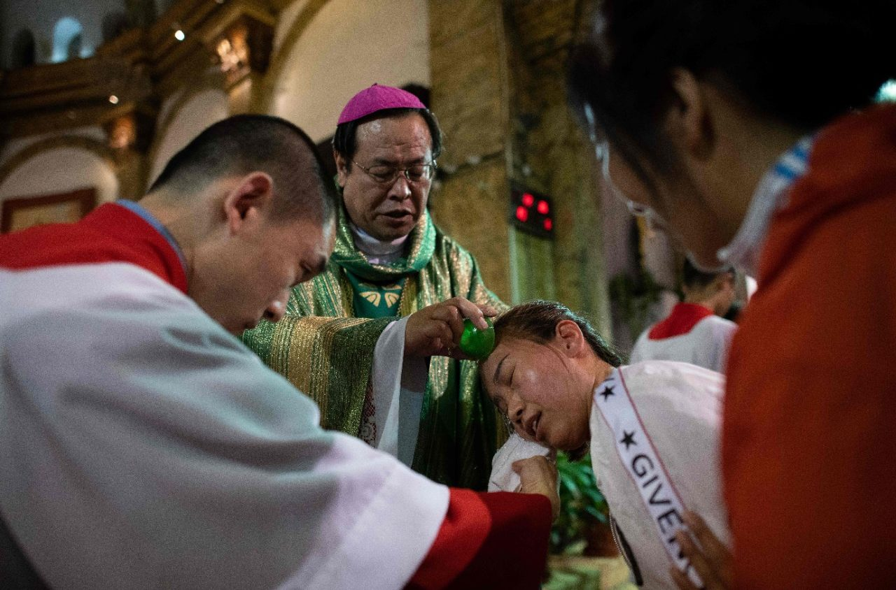

# 圣座关于中国神职人员民事登记的牧灵指导

## 概要

- 作者: 梵蒂冈新闻网
- 来源: [https://www.vaticannews.va/zh/vatican-city/news/2019-06/pastoral-guidelines-holy-see-concerning-civil-registration-clerg.html](https://www.vaticannews.va/zh/vatican-city/news/2019-06/pastoral-guidelines-holy-see-concerning-civil-registration-clerg.html)

## 内容

一段时间以来，中国大陆的主教们请求圣座就必须提交民事登记申请时所应采取的态度做出具体的指示。就这一点，众所周知，许多牧人都深感困惑，因为这一登记方式——按照宗教活动的新规定是必需的，否则就不能从事牧灵活动——几乎总是要签署一份文件，声明接受中国独立、自主、自办教会的原则，尽管中国当局承诺也会尊重天主教教义。

中国现实的复杂性，加之在整个国家似乎不存在规范宗教事务的统一实施常规，也就特别难以对这一问题发表意见。一方面，圣座无意强迫任何人的良心。另一方面，考虑到秘密状态的经验并非教会生活的常规，且历史告诉我们，只有当迫切渴望维护自身信仰的完整性时，牧人和信友们才会这样做（参见《教宗本笃十六致在中华人民共和国的天主教会的主教、司铎、度奉献生活者及教友的信》8，二〇〇七年五月二十七日）。为此，圣座继续要求神职人员的民事登记应保证尊重所涉及人员的良心及他们深刻的公教信念。事实上，只有这样，才能既有助于教会的合一，也有助于天主教徒为中国社会的益处做贡献。

至于评估在登记时必须签署可能要作的声明，首先，有必要记住中华人民共和国宪法正式声明保护宗教自由（第36条）。其二，二〇一八年九月二十二日的临时协议承认伯多禄继承人的特殊作用，从逻辑上讲，也就让圣座认为并解读，在中国的天主教会的“独立”不是绝对意义上的独立——也就是说同教宗和普世教会分离，而仅相对于政治领域而言，就像世界各地教宗和一个地方教会之间的关系或者各地方教会之间关系中所发生的一样。此外，申明在公教身份中不能有与伯多禄继承人的分离，并不意味着使一个地方教会成为其生活并开展活动的社会和文化中的一个异物。其三，体现了双方稳固对话特点的中国与圣座目前关系的背景，与上个世纪五十年代爱国组织刚产生时是不同的。其四，再加上一个非常重要的事实，多年来，许多未经教宗任命而被祝圣的主教们请求并获得了与伯多禄继承人的修和。由此，所有的中国主教今天都与宗座共融，他们渴望与全世界的天主教主教们更加一体化。

在这些事实面前，期待每个人都有一个新的态度是合理的，包括在处理有关教会生活的实际问题时也是如此。就圣座而言，将继续就主教和司铎的民事登记问题同中国当局对话，以找到一个不仅尊重中国法律且尊重天主教教义的登记程式。

同时，鉴于上述情况，如果一位主教或司铎决定进行民事登记，但登记的声明文本似乎不尊重天主教信仰时，他在签字时以书面的形式说明，他这样做，没有缺少对天主教教义原则所应有的忠诚。如果无法以书面形式作出这一说明，申请人也可以只在口头上表达，如果可能的话在一位证人的见证下表达。总之，建议申请人随后向自己的教区教长书面证明其登记的意向。事实上，始终应将这样做的唯一目的理解为旨在促进教区团体的益处，及其在合一精神内的成长、适应中国社会新需求的福传、负责任地管理教会财产。

同时，圣座理解并尊重那些在良心上决定不能在现有条件下登记的人的选择。圣座与他们同在；求上主帮助他们保持与手足兄弟们在信仰内的共融，包括在他们每个人将要面临的考验前也要这样做。

就主教而言，“要尊重司铎、公开地展示自己对司铎的尊重，表现出对他们的信任，如果他们堪当的话，要赞扬他们；尊重他们的权力并使他们的权力得到尊重、保护他们免遭毫无根据的批评；及时地解决争端以免延续的焦虑不安令手足间的爱德蒙羞、损害牧灵使命”（主教牧职指南《宗徒的继承人》77，二OO四年二月二十二日）。

此外，重要的是教友们不但要理解上面所描述情况的复杂性，而且也要以宽阔的胸怀接受他们的牧人们所做出的痛苦决定，无论是什么样的决定。地方天主教团体要以信德精神、祈祷和爱陪伴牧人们，同时不要评判他人的选择、保持合一的纽带、用慈悲善待所有人。

总之，在等待双方按照协议通过坦诚及建设性对话达成更加尊重天主教教义以及所涉及人士良心的神职人员民事登记方式时，圣座要求不要对“非官方”天主教团体施加恐吓性压力，就像已经不幸发生的那样。

最后，圣座相信，所有人都能将这一牧灵指示视为一个工具，帮助那些要做出艰难抉择的人本着信仰与合一的精神来完成这一选择。在中国天主教会所经历的这段既充满了许多希望但也持续不断地出现很多困难的历程中，所有人——圣座、主教、司铎、修会会士、修女和平信徒——蒙召耐心地、谦逊地辨别天主的圣意。

二〇一九年六月二十八日，耶稣圣心瞻礼

自梵蒂冈
