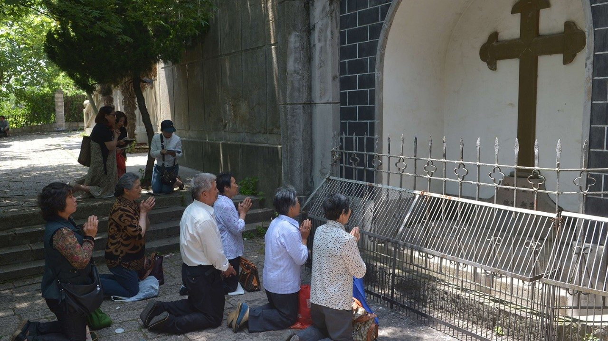

# 圣座为中国神职人员提供的牧灵指南旨在尊重良心自由

## 概要

- 作者: 梵蒂冈新闻网
- 来源: [https://www.vaticannews.va/zh/vatican-city/news/2019-06/tornielli-china-catholic-clergy-state-register-respect-conscienc.html](https://www.vaticannews.va/zh/vatican-city/news/2019-06/tornielli-china-catholic-clergy-state-register-respect-conscienc.html)

>《圣座关于中国神职人员民事登记的牧灵指导》于6月28日公诸于世，圣座传播部编辑主任托尔涅利为此撰文，表示其目的在于维护天主教教义和良心自由。

## 内容

（梵蒂冈新闻网）绝对尊重每个人的良心自由、对中国天主教团体时至今日的处境表示关怀和理解，以及提出具体建议，使神职人员在不违背与伯多禄继承人共融的教会信念下为民事登记作出选择。这些是《圣座关于中国神职人员民事登记的牧灵指导》的实质内容。

圣座传播部编辑主任托尔涅利6月28日发表社论，阐明圣座这份《牧灵指南》的几个要点。首先，这份文件是在中国神职人员提出的许多请求后撰写而成。他们的问题是：面对当局法律规定应提交民事登记的迫切要求该持何种态度？在经常被要求签署一些有疑问的文件时，如何对待良心上的困境？

面对这些疑问，圣座首先重申一项基本普遍的原则：良心自由必须受到尊重，因此任何人都不可被强迫作出违背自己意愿的事。

圣座与中华人民共和国关于主教任命的临时性协议在中梵关系上开启一段新行程，带来了所有中国主教与教宗共融的首要成果。但这并非一切难题都得到解决，因为协议只是这段行程的开端。按照中国法律规定，司铎和主教被要求进行民事登记就是当前的困难之一。

尽管努力寻找一种彼此都能接受的解决方案，在中华人民共和国不同地区的司铎仍被要求签署一些不合乎天主教教义的文件，这在他们良心上造成的困难是可以理解的，因为他们被要求接受在中国的教会必须自立、自养和自传的原则。

今天与上个世纪50年代的情况极为不同，那时的确企图建立一个脱离罗马的国家教会。今天，藉著临时性协议，北京当局承认罗马主教在主教候选人的拣选上具有特殊角色，以及他身为普世教会牧人的权威。圣座正在继续努力，以期在神职人员进行登记时的每项声明和要求不仅符合中国法律，也与天主教教义一致，使主教和司铎能够接纳。

鉴于中国基督徒团体的特殊情况，在等待最终使问题得到解决的同时，圣座建议一种具体可行的方式，使持有疑惑，但愿意进行登记的人能够解除顾虑。

这些建议配合了本笃十六世于2007年《致中国天主教徒信函》中所开辟的道路。拉青格教宗在信函中承认，“有为数不少的具体案例，若不说是经常地发生，某些机构的干预迫使有关人士要作出有违他们的天主教良知的表态行为和承诺”（7号）。

他又写道：“为此，我明白在此类条件和情况下要作出正确选择是困难的。所以，圣座在重申了原则后，让个别主教来决定，因为主教在听取了其司铎们的意见后，能更好地了解当地的情况、衡量具体的选择、评估给教区团体内部可能带来的后果。”（同上）

这位教宗于12年前就显示出他对有关情况的了解，因而让个别主教在考虑到各自团体的益处之后，自己作出决定。

如今，在与过去有所不同的客观环境下，圣座开启一段属于牧灵性质的新行程。藉著新公布的《牧灵指南》，建议主教和司铎在作出登记时应要求添加一句书面说明，表明以不违背天主教教义的原则来理解教会的自立、自养和自传。换言之，就是政治上的自立、管理上的自养和牧灵上的自传。

如果无法作出书面说明，至少要在口头上清楚表明，尽可能有一位证人在场。在进行了登记后，应立即通知自己的主教并说明是在何种情况下完成登记的。不过，谁若不愿在这些条件下进行登记，也不该受到不应有的压力。

托尔涅利重申，这份《牧灵指南》显然正是以注重现实的目光看待现有的情况和仍然存在的困难、帮助那些陷入疑惑的人，同时总是尊重每个人的良知、愿意对中国天主教徒的合一作出贡献，以及鼓励主教和司铎们为了信友的益处而公开履行牧职，正如本笃十六世在信函中所表明的那样，“秘密狀态并非属于教会生活的常规”（同上9号）。

托尔涅利最后阐明，在这份《牧灵指南》中并不存在天真的思想。正如内文所言，圣座意识到许多中国天主教徒蒙受的“恐吓性压力”，但愿意表明在不偏离教会共融的基本原则下，我们能够展望未来并共同行走。正是教宗的关怀使这指南建立在基督信仰的望德上，紧随推动教会前行的圣神来书写新的篇章。
